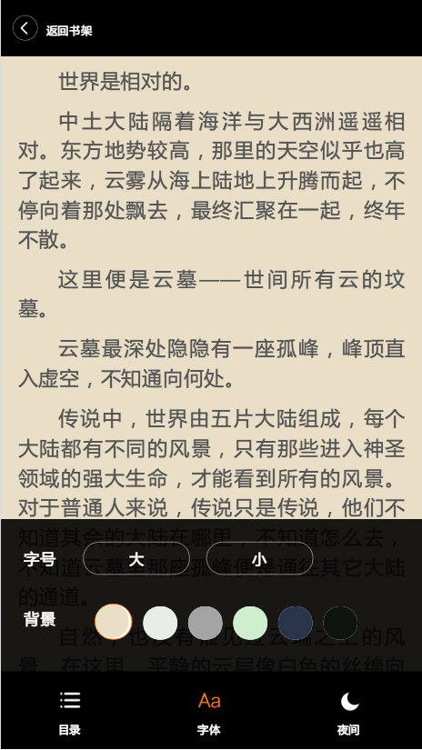
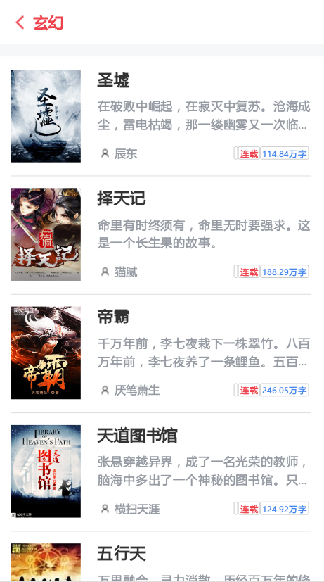

## 基于vue+express+nodejs爬虫的移动书城 [ssr版本](https://github.com/tgxhx/vue-reader-ssr)

> 技术栈：vue + vue-router + vuex + webpack + axios + less + flex + express + nodejs + mysql + localStorage

> [预览地址](https://vue-reader.xyxxxx.xyz)

> [爬虫地址](https://github.com/tgxhx/node-crawler)

> 自用sql文件下载，包含了本项目接口使用的数据，可直接导入mysql中，[下载地址(百度网盘)](https://pan.baidu.com/s/1b08B3S)，[下载地址(Google Drive)](https://drive.google.com/open?id=17jlzFj0kJIhEtAllzeVbZVzXuQi7O8bm)

## 使用说明

``` bash
#克隆项目
git clone git@github.com:tgxhx/vue-reader.git

# 安装依赖
npm install

# 本地开发环境，同时会启动webpack-dev-server和express服务，访问http://localhost:8080
npm start

# 构建生产
npm run build

# 分析构建文件
npm run analyze

# 部署
sudo chmod +x docker-build.sh
./docker-build.sh

```

## 项目说明

### 2019-04-14更新

最近闲下来抽时间重构了一下这个项目的架构，将对应的node服务整合了进来，并且集成了docker构建及部署。

使用首先需要能连接到mysql，并先导入上面的sql文件，然后在`server`目录下创建`config/index.js`：

``` javascript
module.exports = {
  mysql: {
    host: 'x.x.x.x',
    user: 'xxx',
    password: 'xxx',
    database: 'xxx',
    port: 3306,
  },
};

```

=============分隔线===============

该项目很早以前就开始写了，算是用vue写的第一个项目，所以代码还是有不少问题，但是应该很符合vue入门使用者的写法，比如直接修改state：this.$store.state.xx = xx。

最开始是用jQuery写了阅读器部分，后来为了学习，就尝试用vue重构，学习了整个vue技术栈。

后来想想阅读器写好了，没有书可不行，想想应该用爬虫爬点数据，于是各种查找node爬虫的资料，写了不少爬虫，本项目使用的爬虫地址在这：[地址](https://github.com/tgxhx/node-crawler)。

数据有了，接下来该构建api了，谷歌了一下发现用express好像不错，于是又学习了express部分，构建了所需的api,[地址在这](https://github.com/tgxhx/node-book-api)。

有的同学刚开始学习vue的时候可能有点茫然，不光是vue本身的用法、api、组件等等，查资料后发现还有vue-router、vuex等等需要学习。

本项目就是那个阶段写的第一个比较完善的vue项目，现在才拿出来是因为中间有不少事耽搁了，如果你想看代码，可能会发现不少地方跟自己写得很像，一共只有四个路由，够简单吧，但是用到的东西在其他复杂应用中也是必需的，仔细想想其实vue也就那么点东西，多写就容易了。

vue-router方面，常用的内容基本都用到了，比如
动态路由、编程式导航、命名路由、重定向、数据获取时的loading、懒加载等等。

vuex采用分离的写法，state、mutation、action分开写，方便维护。

另外本项目中还写了一些可直接迁移使用的组件、比如loading组件、左右弹出层的背景阴影组件。

## 功能
- [x] 首页推荐
- [x] 书籍详情
- [x] 相似推荐
- [x] 分类查看 
- [x] 阅读器 
- [x] 章节跳转
- [x] 更改字体
- [x] 更换主题
- [x] 夜间模式
- [x] 翻页浏览
- [x] 本地存储（存储每本书的阅读进度）
- [ ] 书架（待考虑）


## 项目截图




